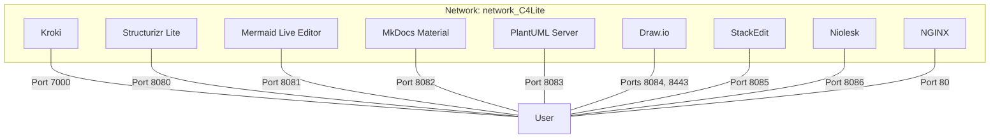
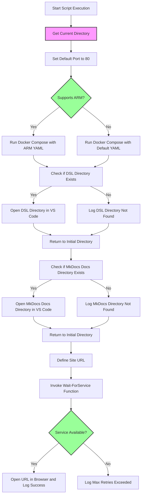
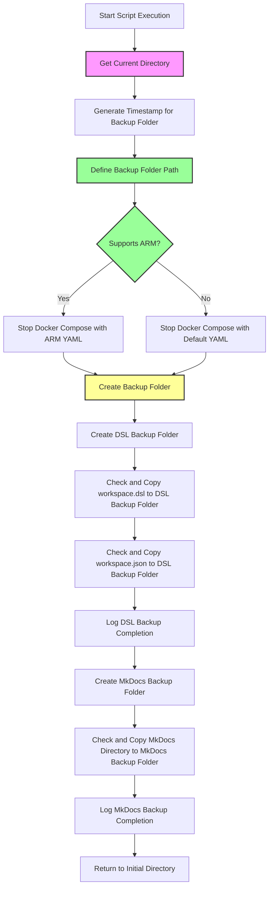

# Project Name: DiagramHub

## Overview
DiagramHub is a comprehensive, all-in-one environment designed to enhance and streamline the creation, management, and visualization of various types of diagrams and documentation. This project leverages Docker Compose to orchestrate a suite of powerful tools, making it an ideal solution for developers, architects, and documentarians.

The services include:
- Structurizr Lite for software architecture diagrams
- Mermaid Live Editor for live diagram editing
- Draw.io for a web-based diagramming tool
- PlantUML Server supports UML diagram generation

For documentation:
- MkDocs Material offers a sleek interface for creating static sites
- StackEdit provides a robust Markdown editor with real-time preview.


By integrating these tools, DiagramHub aims to provide a seamless, efficient workflow for all your diagramming and documentation needs.

This project includes PowerShell scripts to manage the Docker services and create backups. Here is a breakdown of the key components.

## Helpfull Visual Studio Code Extentions
- [https://marketplace.visualstudio.com/items?itemName=ciarant.vscode-structurizr](https://marketplace.visualstudio.com/items?itemName=ciarant.vscode-structurizr)
- [https://marketplace.visualstudio.com/items?itemName=bierner.markdown-mermaid](https://marketplace.visualstudio.com/items?itemName=bierner.markdown-mermaid)

# Project Structure


## Files and Directories
```
.
├── docker-compose.yml      # Defines Docker services for Structurizr Lite, Mermaid Live Editor, MkDocs Material, and Nginx.
├── docker-compose-ARM.yml  # Defines Docker services for Structurizr Lite, Mermaid Live Editor, MkDocs Material, and Nginx for the ARM.
├── up.ps1                  # PowerShell script to start the Docker services and open Structurizr Lite service in a browser.
├── down.ps1                # PowerShell script to stop the Docker services and create backups of the DSL files.
├── Backup/                 # Directory where backups are stored.
└── README.md               # Documentation for the project.
```

## Docker Compose Configuration
The `docker-compose.yml` and `docker-compose-ARM.yml` file defines the following services:

# Docker Compose Services Description

This Docker Compose file defines a set of services for diagramming, documentation, and visualization tasks. Here's an updated breakdown:

## Services

### 1. **Kroki**
- **Purpose:** Diagram rendering service supporting various formats (PlantUML, Mermaid, Graphviz, etc.).
- **Image:** `yuzutech/kroki`
- **Ports:** Exposes port `7000` (mapped to container's `8000`).
- **Restart Policy:** Always restarts on failure.
- **Network:** Connected to `network_C4Lite`.

### 2. **Structurizr Lite**
- **Purpose:** Hosts a lightweight version of Structurizr for C4 modeling with DSL support.
- **Image:** `structurizr/lite`
- **Volumes:** Maps local `./dsl` directory to `/usr/local/structurizr` in the container.
- **Ports:** Accessible on port `8080`.
- **Restart Policy:** Always restarts on failure.
- **Network:** Connected to `network_C4Lite`.

### 3. **Mermaid Live Editor**
- **Purpose:** Provides a live editor for creating Mermaid diagrams.
- **Image:** `ghcr.io/mermaid-js/mermaid-live-editor`
- **Platform:** Runs on `linux/amd64`.
- **Volumes:** Mounts local `./mermaid` directory to `/app/data` in the container.
- **Ports:** Accessible on port `8081`.
- **Restart Policy:** Always restarts on failure.
- **Network:** Connected to `network_C4Lite`.

### 4. **MkDocs Material**
- **Purpose:** Hosts documentation built with MkDocs and the Material theme.
- **Build:** Built from a custom Dockerfile (`customMkdocsBuild`) in the current directory.
- **Volumes:** Mounts local `./mkdocs` directory to `/docs` in the container.
- **Ports:** Accessible on port `8082`.
- **Restart Policy:** Always restarts on failure.
- **Network:** Connected to `network_C4Lite`.

### 5. **PlantUML Server**
- **Purpose:** Provides a PlantUML rendering server.
- **Image:** `plantuml/plantuml-server:jetty`
- **Ports:** Accessible on port `8083`.
- **Restart Policy:** Always restarts on failure.
- **Network:** Connected to `network_C4Lite`.

### 6. **Draw.io**
- **Purpose:** Hosts a collaborative diagramming tool (diagrams.net).
- **Image:** `jgraph/drawio`
- **Ports:** Accessible on ports `8084` (HTTP) and `8443` (HTTPS).
- **Restart Policy:** Always restarts on failure.
- **Network:** Connected to `network_C4Lite`.

### 7. **StackEdit**
- **Purpose:** Hosts a Markdown editor with collaborative features.
- **Image:** `benweet/stackedit`
- **Ports:** Accessible on port `8085`.
- **Restart Policy:** Always restarts on failure.
- **Network:** Connected to `network_C4Lite`.

### 8. **Niolesk**
- **Purpose:** Offers an application integrated with Kroki for diagram rendering.
- **Image:** `ghcr.io/webgiss/niolesk`
- **Ports:** Accessible on port `8086`.
- **Environment Variable:** Configures Kroki as its diagram rendering engine.
- **Restart Policy:** Always restarts on failure.
- **Network:** Connected to `network_C4Lite`.

### 9. **NGINX**
- **Purpose:** Acts as a static file server or reverse proxy.
- **Image:** `nginx:latest`
- **Volumes:**
  - Mounts `./splash` to serve static HTML files.
  - Uses a custom NGINX configuration file (`./nginx/nginx.conf`).
- **Ports:** Maps container port `80` to host port `80`.
- **Restart Policy:** Always restarts on failure.
- **Network:** Connected to `network_C4Lite`.

## Networks

### `network_C4Lite`
- **Driver:** Bridge network for inter-service communication.



## PowerShell Scripts
### up.ps1:

Starts the Docker services.
- Opens the dsl directory in Visual Studio Code.
- Opens the mkdocs directory in Visual Studio Code.
- Waits for the Nginx service to be available and opens it in a browser.



### down.ps1:
- Stops the Docker services.
- Creates a timestamped backup directory.
- Copies the current files files to the backup directory.



## Usage Instructions

1. **Start the Service**:
   Run the `up.ps1` script:
   ```powershell
   .\up.ps1
   ```
   This script will start the servicves, monitor it, and open it in your default browser once available.

2. **Stop the Service**:
   Run the `down.ps1` script:
   ```powershell
   .\down.ps1
   ```
   This will stop the service and create a timestamped backup of key files.

---

## Notes
- Ensure Docker and Docker Compose are installed and configured.
- Backup files are stored in the `Backup` directory under a timestamped folder.
- The site runs at [http://localhost:80](http://localhost:80) by default.

