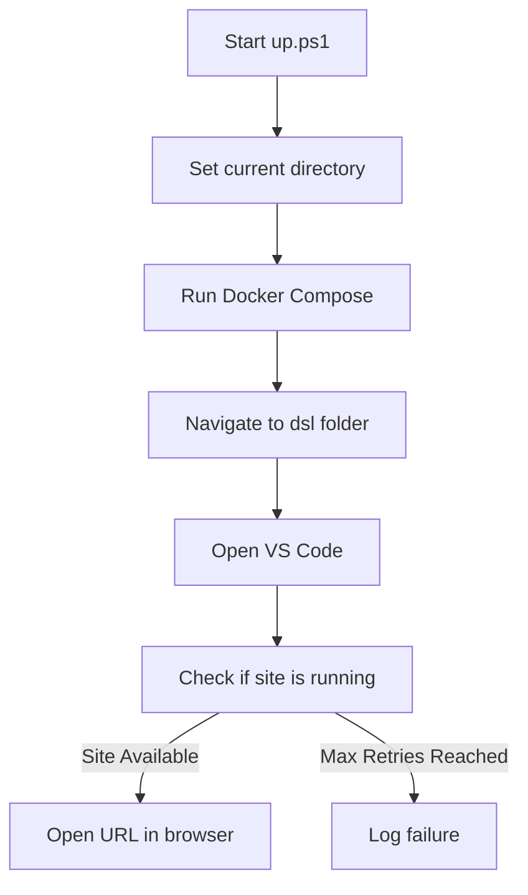
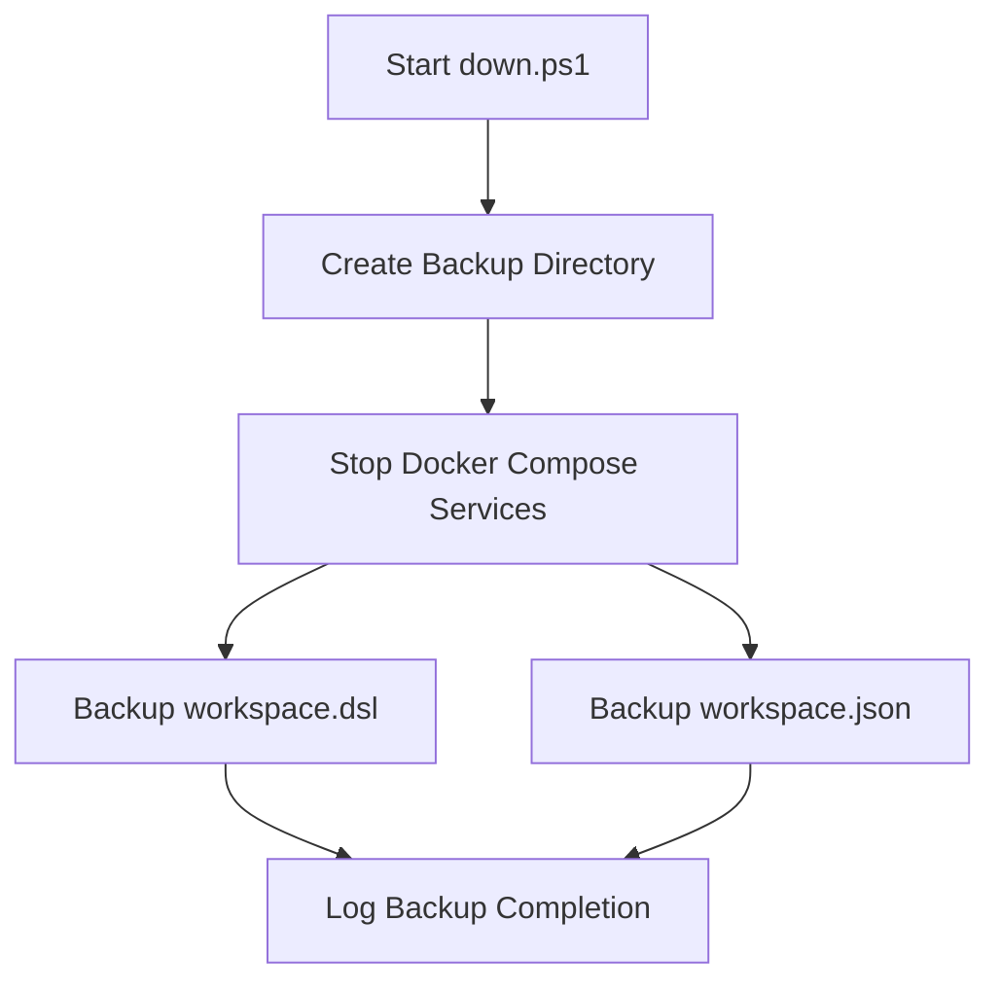

# Structurizr Lite Project Setup

This project uses Docker Compose to run Structurizr Lite for visualizing and editing C4 diagrams.

This documentation provides a guide to using the `up.ps1` and `down.ps1` scripts for managing a Docker-based Structurizr Lite instance. These scripts automate starting, stopping, and backing up the environment.

---

## **Project Structure**

```plaintext
.
├── docker-compose.yml      # Docker configuration file
├── up.ps1                  # PowerShell script to start the service
├── down.ps1                # PowerShell script to stop the service and create backups
├── Backup/                 # Directory for storing backups
└── README.md               # Documentation
```

---

## Docker Compose Configuration
The scripts rely on the following docker-compose.yml for Docker configuration and the following scripts

### **up.ps1**
This script:
1. Starts the Structurizr Lite service using Docker Compose.
2. Navigates to the `dsl` directory and opens Visual Studio Code.
3. Monitors the service and opens it in the default browser once it becomes available.

#### Process Diagram


---

### **down.ps1**
This script:
1. Stops the Structurizr Lite service.
2. Creates a backup directory with a timestamp.
3. Backs up the `workspace.dsl` and `workspace.json` files.

#### Process Diagram


---

## Usage Instructions

1. **Start the Service**:
   Run the `up.ps1` script:
   ```powershell
   .\up.ps1
   ```
   This script will start the Structurizr Lite service, monitor it, and open it in your default browser once available.

2. **Stop the Service**:
   Run the `down.ps1` script:
   ```powershell
   .\down.ps1
   ```
   This will stop the service and create a timestamped backup of key files.

---

## Notes
- Ensure Docker and Docker Compose are installed and configured.
- Backup files are stored in the `Backup` directory under a timestamped folder.
- The site runs at [http://localhost:8080](http://localhost:8080) by default.
