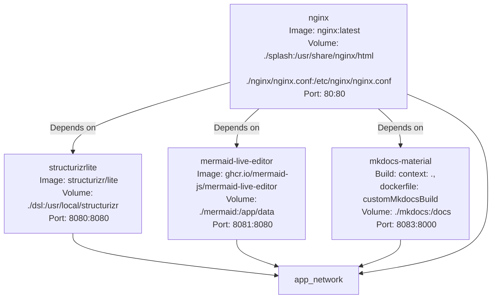
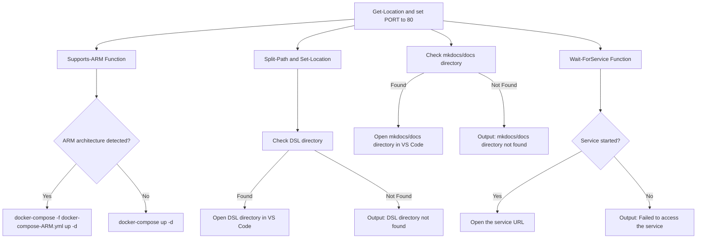
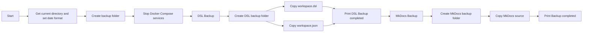

# C4Lite

## Overview
This project is a Docker-based setup for running Structurizr Lite, Mermaid Live Editor, and MkDocs Material. It includes PowerShell scripts to manage the Docker services and create backups. Here is a breakdown of the key components.

## Helpfull Visual Studio Code Extentions
- [https://marketplace.visualstudio.com/items?itemName=ciarant.vscode-structurizr](https://marketplace.visualstudio.com/items?itemName=ciarant.vscode-structurizr)
- [https://marketplace.visualstudio.com/items?itemName=bierner.markdown-mermaid](https://marketplace.visualstudio.com/items?itemName=bierner.markdown-mermaid)

## Project Structure

## Overview
This project uses Docker to run multiple services for documentation and diagram creation. Below is the detailed structure and configuration.

## Files and Directories
```
.
├── docker-compose.yml      # Defines Docker services for Structurizr Lite, Mermaid Live Editor, MkDocs Material, and Nginx.
├── docker-compose-ARM.yml      # Defines Docker services for Structurizr Lite, Mermaid Live Editor, MkDocs Material, and Nginx for the ARM.
├── up.ps1                  # PowerShell script to start the Docker services and open Structurizr Lite service in a browser.
├── down.ps1                # PowerShell script to stop the Docker services and create backups of the DSL files.
├── Backup/                 # Directory where backups are stored.
└── README.md               # Documentation for the project.
```

## Docker Compose Configuration
The `docker-compose.yml` file defines the following services:

- **structurizrlite**: 
  - Runs Structurizr Lite for creating and editing C4-style architecture diagrams.
  
- **mermaid-live-editor**: 
  - Runs Mermaid Live Editor for creating diagrams using Mermaid.js.
  
- **mkdocs-material**: 
  - Runs MkDocs Material for generating and serving static documentation sites.
  
- **nginx**: 
  - Runs Nginx to serve a splash page that links to the other services.




## PowerShell Scripts
### up.ps1:

Starts the Docker services.
Opens the dsl directory in Visual Studio Code.
Waits for the Nginx service to be available and opens it in a browser.



### down.ps1:
Stops the Docker services.
Creates a timestamped backup directory.
Copies the workspace.dsl and workspace.json files to the backup directory.



## Usage Instructions

1. **Start the Service**:
   Run the `up.ps1` script:
   ```powershell
   .\up.ps1
   ```
   This script will start the servicves, monitor it, and open it in your default browser once available.

2. **Stop the Service**:
   Run the `down.ps1` script:
   ```powershell
   .\down.ps1
   ```
   This will stop the service and create a timestamped backup of key files.

---

## Notes
- Ensure Docker and Docker Compose are installed and configured.
- Backup files are stored in the `Backup` directory under a timestamped folder.
- The site runs at [http://localhost:80](http://localhost:80) by default.

