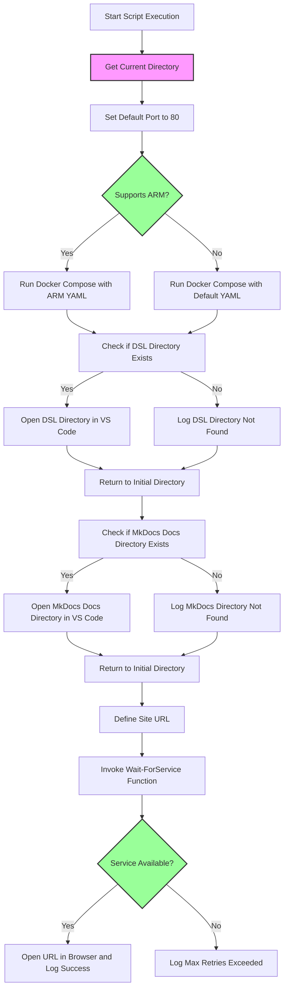
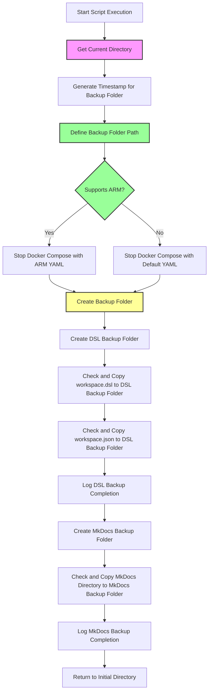

# Project Name: DiagramHub

## Overview
DiagramHub is a comprehensive, all-in-one environment designed to enhance and streamline the creation, management, and visualization of various types of diagrams and documentation. This project leverages Docker Compose to orchestrate a suite of powerful tools, making it an ideal solution for developers, architects, and documentarians.

The services include:
- Structurizr Lite for software architecture diagrams
- Mermaid Live Editor for live diagram editing
- Draw.io for a web-based diagramming tool
- PlantUML Server supports UML diagram generation

For documentation:
- MkDocs Material offers a sleek interface for creating static sites
- StackEdit provides a robust Markdown editor with real-time preview.


By integrating these tools, DiagramHub aims to provide a seamless, efficient workflow for all your diagramming and documentation needs.

This project includes PowerShell scripts to manage the Docker services and create backups. Here is a breakdown of the key components.

## Helpfull Visual Studio Code Extentions
- [https://marketplace.visualstudio.com/items?itemName=ciarant.vscode-structurizr](https://marketplace.visualstudio.com/items?itemName=ciarant.vscode-structurizr)
- [https://marketplace.visualstudio.com/items?itemName=bierner.markdown-mermaid](https://marketplace.visualstudio.com/items?itemName=bierner.markdown-mermaid)

# Project Structure


## Files and Directories
```
.
├── docker-compose.yml      # Defines Docker services for Structurizr Lite, Mermaid Live Editor, MkDocs Material, and Nginx.
├── docker-compose-ARM.yml  # Defines Docker services for Structurizr Lite, Mermaid Live Editor, MkDocs Material, and Nginx for the ARM.
├── up.ps1                  # PowerShell script to start the Docker services and open Structurizr Lite service in a browser.
├── down.ps1                # PowerShell script to stop the Docker services and create backups of the DSL files.
├── Backup/                 # Directory where backups are stored.
└── README.md               # Documentation for the project.
```

## Docker Compose Configuration
The `docker-compose.yml` and `docker-compose-ARM.yml` file defines the following services:

# Docker Compose Services Description

## 1. Structurizr Lite
- **Image:** `structurizr/lite`
- **Container Name:** `structurizrlite`
- **Description:** Lightweight version of Structurizr for creating and editing software architecture diagrams.
- **Ports:** 
  - `8080:8080` (mapped to host)
- **Volumes:** 
  - `./dsl:/usr/local/structurizr` (to store DSL files)
- **Networks:** 
  - `app_network` (shared with other services)
- **Restart Policy:** `always`

---

## 2. Mermaid Live Editor
- **Image:** `ghcr.io/mermaid-js/mermaid-live-editor`
- **Container Name:** `mermaid-live-editor`
- **Description:** Live editor for creating and previewing Mermaid.js diagrams.
- **Ports:** 
  - `8081:8080` (mapped to host)
- **Volumes:** 
  - `./mermaid:/app/data` (to store diagram data)
- **Networks:** 
  - `app_network` (shared with other services)
- **Platform:** `linux/amd64`
- **Restart Policy:** `always`

---

## 3. MkDocs Material
- **Build Context:** Local directory with a custom Dockerfile (`customMkdocsBuild`)
- **Container Name:** `mkdocs-material`
- **Description:** MkDocs with Material theme for building and serving documentation websites.
- **Ports:** 
  - `8082:8000` (mapped to host)
- **Volumes:** 
  - `./mkdocs:/docs` (to store MkDocs documentation files)
- **Networks:** 
  - `app_network` (shared with other services)
- **Restart Policy:** `always`

---

## 4. PlantUML Server
- **Image:** `plantuml/plantuml-server:jetty`
- **Container Name:** `plantuml-server`
- **Description:** Server for rendering PlantUML diagrams.
- **Ports:** 
  - `8083:8080` (mapped to host)
- **Networks:** 
  - `app_network` (shared with other services)
- **Restart Policy:** `always`

---

## 5. Draw.io
- **Image:** `jgraph/drawio`
- **Container Name:** `draw`
- **Description:** Web-based diagramming tool for creating flowcharts, UML diagrams, and more.
- **Ports:** 
  - `8084:8080` (mapped to host)
  - `8443:8443` (mapped to host, secure access)
- **Networks:** 
  - `app_network` (shared with other services)
- **Restart Policy:** `always`

---

## 6. StackEdit
- **Image:** `benweet/stackedit`
- **Container Name:** `stackedit`
- **Description:** Markdown editor for creating and editing documents with real-time preview.
- **Ports:** 
  - `8085:8080` (mapped to host)
- **Networks:** 
  - `app_network` (shared with other services)
- **Restart Policy:** `always`

---

## 7. Nginx
- **Image:** `nginx:latest`
- **Container Name:** `service-splash`
- **Description:** Web server for serving static files or acting as a reverse proxy.
- **Ports:** 
  - `80:80` (mapped to host)
- **Volumes:** 
  - `./splash:/usr/share/nginx/html` (to store static files for the splash page)
  - `./nginx/nginx.conf:/etc/nginx/nginx.conf` (to provide a custom Nginx configuration)
- **Networks:** 
  - `app_network` (shared with other services)
- **Restart Policy:** `always`

---

## Network: app_network
- **Driver:** `bridge`
- **Description:** Shared network that connects all the services, allowing inter-service communication.


## PowerShell Scripts
### up.ps1:

Starts the Docker services.
- Opens the dsl directory in Visual Studio Code.
- Opens the mkdocs directory in Visual Studio Code.
- Waits for the Nginx service to be available and opens it in a browser.



### down.ps1:
- Stops the Docker services.
- Creates a timestamped backup directory.
- Copies the current files files to the backup directory.



## Usage Instructions

1. **Start the Service**:
   Run the `up.ps1` script:
   ```powershell
   .\up.ps1
   ```
   This script will start the servicves, monitor it, and open it in your default browser once available.

2. **Stop the Service**:
   Run the `down.ps1` script:
   ```powershell
   .\down.ps1
   ```
   This will stop the service and create a timestamped backup of key files.

---

## Notes
- Ensure Docker and Docker Compose are installed and configured.
- Backup files are stored in the `Backup` directory under a timestamped folder.
- The site runs at [http://localhost:80](http://localhost:80) by default.

